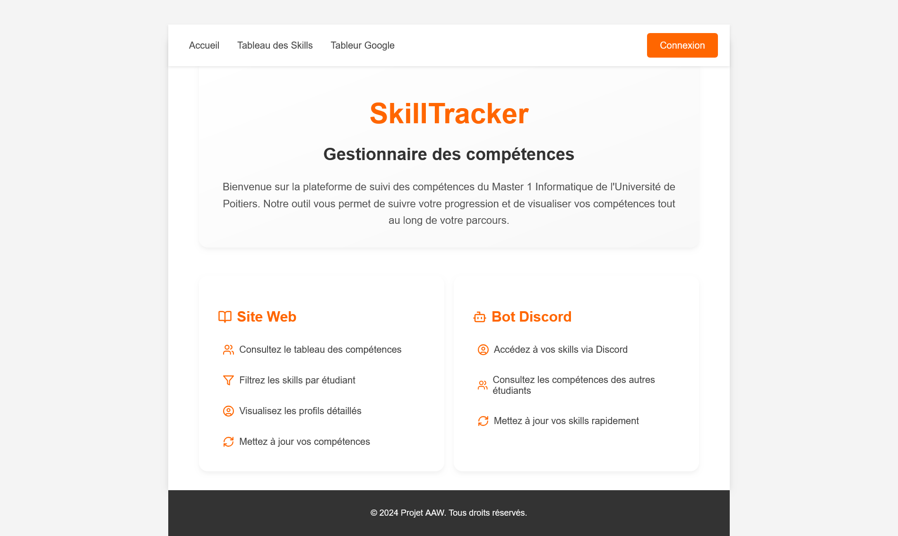

# SkillTracker Project

## Description

The SkillTracker Project is a complete application for managing and visualizing user skills within a group. The project includes:
- **A web application** for viewing and editing skills
- **A Discord bot** for interacting with data directly from Discord
- **An API** for data management and authentication

## Project Information

- **Context**: University team project
- **Development Team**: 3 students
- **Duration**: 1 months
- **Year**: 2024
- **University**: University of Poitiers
- **Main Language**: React/Vite
- **Target Platform**: Web application

## Key Features

### Web Application
- **Home page**: Project overview and navigation
- **Skills list**: Overview of all user skills
- **Discord authentication**: Secure login via OAuth2
- **Individual profiles**: View and edit skills per person
- **Admin panel**: Management of connected users

### Discord Bot
- View skills through commands
- Edit your own skills
- Command prefix system

### API
- Discord OAuth2 authentication management
- Google Sheets interface for data storage
- Secure endpoints for CRUD operations

## Screenshots

### Home page


### Skills list
.webp)

### Discord login
.webp)

### Admin panel
.webp)

### Individual profile
.webp)

## Project Structure

```
skilltracker-project/
├── botdiscord/
│   ├── src/
│   │   ├── commands/
│   │   ├── events/
│   │   ├── structure/
│   │   └── utils/
│   ├── .env
│   ├── spreadsheet.json
│   ├── index.js
│   └── package.json
├── client/
│   ├── src/
│   │   ├── components/
│   │   ├── pages/
│   │   └── utils/
│   ├── .env
│   ├── spreadsheet.json
│   ├── index.html
│   └── package.json
├── server/
│   ├── middlewares/
│   ├── routes/
│   ├── services/
│   └── utils/
│   ├── .env
│   ├── spreadsheet.json
│   ├── index.js
│   └── package.json
├── images/
│   ├── skillTracker-project.webp
│   ├── skillTracker-project(skills).webp
│   ├── skillTracker-project(connect).webp
│   ├── skillTracker-project(admin).webp
│   └── skillTracker-project(fiche).webp
└── README.md
```

## Configuration

### Google Sheets Setup

1. **Create a Google Sheets document** with the following columns:
   - **Name**: User's name
   - **Discord ID**: Unique Discord identifier
   - **Last Update**: Last modification date
   - **[Skills]**: Columns for each skill (e.g., Cooking, Sports, Programming, etc.)

2. **Enable Google Sheets API**:
   - Go to the [Google Cloud Console](https://console.cloud.google.com/)
   - Create a new project or select an existing one
   - Enable the Google Sheets API
   - Go to "APIs & Services" > "Credentials"
   - Click "Create Credentials" > "Service Account"
   - Download the JSON key file
   - Rename it to `spreadsheet.json` and place it in the `client/`, `server/`, and `botdiscord/` directories

3. **Share your Google Sheets**:
   - Open your Google Sheets document
   - Click "Share" and add the service account email (found in `spreadsheet.json`) with Editor permissions

### Discord Application Setup

1. **Create a Discord Application**:
   - Go to the [Discord Developer Portal](https://discord.com/developers/applications)
   - Click "New Application"
   - Go to the "Bot" section and create a bot
   - Copy the bot token for your environment variables

2. **OAuth2 Setup**:
   - In the "OAuth2" section, add your redirect URI: `http://localhost:3000/auth/discord/callback`
   - Note your Client ID and Client Secret

3. **Bot Permissions**:
   - In the "Bot" section, enable the necessary permissions:
     - Send Messages
     - Read Message History
     - Use Slash Commands

### Environment Variables

#### For the server (`server/.env`)
```env
# Google Sheets Configuration
VITE_SPREADSHEET_ID="your_spreadsheet_id"
VITE_RANGE="sheet_name"

# Discord OAuth2 Configuration
DISCORD_CLIENT_ID="your_client_id"
DISCORD_CLIENT_SECRET="your_client_secret"
DISCORD_CALLBACK_URL=http://localhost:3000/auth/discord/callback
SESSION_SECRET="a_secure_random_chain"

# Administration
ADMIN_DISCORD_IDS=id1,id2,id3

# Server Configuration
PORT=3000
SECRET_TOKEN_KEY=<string_character>
PASSWORD=<string_character>
TOKEN=<token>
```

#### For the client (`client/.env`)
```env
# Google Sheets Configuration
VITE_SPREADSHEET_ID="your_spreadsheet_id"
VITE_RANGE="sheet_name"

# API Configuration
VITE_BASE_API_URL=http://localhost:3000
```

#### For the Discord bot (`botdiscord/.env`)
```env
# Discord Bot Configuration
DISCORD_BOT_TOKEN=your_bot_token
DISCORD_CLIENT_ID=your_client_id

# Google Sheets Configuration
VITE_SPREADSHEET_ID="your_spreadsheet_id"
VITE_RANGE="sheet_name"

# Administration
ADMIN_DISCORD_IDS=id1,id2,id3

# API Configuration
BASE_API_URL=http://localhost:3000
API_TOKEN=20618016798589713892511336934969888
MDP_SERVER=tm36XQ375Vuf8Vqje43Jb7JLsPZ4g
SESSION_SECRET="ea78dc821fa403a0d80541b0bdde2a33d63196998b80a45402b655cedab07afba1904df1d5e2d22172155f5e86826a62062d5c4a3234f42891b88ee9aa0024c0"
```

## Required Files

**Important**: Each component (`client/`, `server/`, `botdiscord/`) must contain:
- `.env` file with the appropriate environment variables
- `spreadsheet.json` file with Google Sheets API credentials

## Installation and Launch

### Prerequisites
- Node.js (version 14 or higher)
- npm or yarn
- A Google account with access to Google Sheets API
- A Discord account and application

### 1. API Server
```bash
cd server
npm install
npm start
```
The server will start on `http://localhost:3000`

### 2. Web Client
```bash
cd client
npm install
npm run dev
```
The client will start on `http://localhost:5173` (or another available port)

### 3. Discord Bot
```bash
cd botdiscord
npm install
node index.js
```

## Usage

### Web Application
1. Access the web application at `http://localhost:5173`
2. Log in with your Discord account
3. View skills or edit your own according to your permissions

### Discord Bot

**Prefix**: `mpf!`

**Available commands:**
- `mpf!help`: Shows the list of commands
- `mpf!skills`: Shows all users' skills
- `mpf!skill <@user>`: Shows a specific user's skills
- `mpf!updateskill <SKILL> <Value>`: Updates one of your skills (value between 1 and 10)

**Examples:**
```
mpf!help
mpf!skills
mpf!skill @Victor
mpf!updateskill Cooking 8
```

## Permissions

- **Non-connected user**: View only
- **Connected user**: View + edit own skills
- **Administrator**: View + edit all skills + user management

## Technologies Used

### Frontend (Client)
- **Vite**: Build tool and development server
- **HTML/CSS/JavaScript**: Core web technologies
- **Fetch API**: For API communication

### Backend (Server)
- **Node.js**: Runtime environment
- **Express.js**: Web framework
- **Passport.js**: Authentication middleware
- **Google Sheets API**: Data storage
- **Discord OAuth2**: Authentication

### Discord Bot
- **Discord.js**: Discord API wrapper
- **Node.js**: Runtime environment
- **Google Sheets API**: Data access

## Troubleshooting

### Common Issues

1. **Google Sheets API errors**: 
   - Ensure `spreadsheet.json` is in all three directories
   - Check that the service account has editor permissions on the sheet

2. **Discord authentication issues**:
   - Verify your Discord application settings
   - Check that the callback URL matches your environment

3. **Port conflicts**:
   - Ensure ports 3000 and 5173 are available
   - Modify PORT in `.env` if needed

## Authors

- **Maxime M.**
- **Ronan P.F.**
- **Victor F.**

## Licence

Academic project - Université de Poitiers (2024)

---

*This project is developed for educational purposes.*
